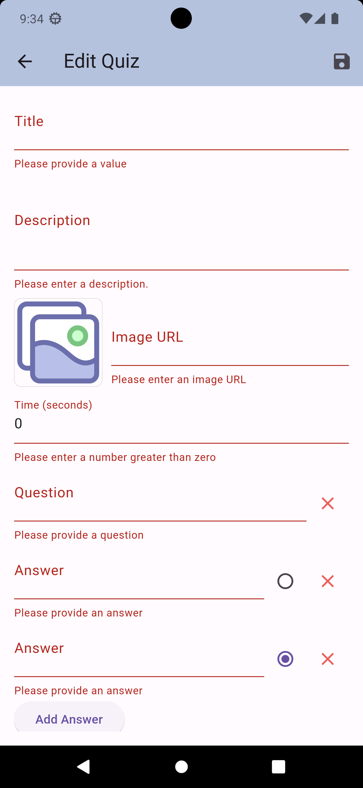

# Project học phần PTUD Di động (CT484)

Học kỳ 1, Năm học 2023-2024

**MSSV 1** :  B1705292

**Họ tên SV 1**: Lý Đại Phát

**Lớp học phần**: PTUD Di động (CT484) - Nhóm 02

**Tên dự án**: Study Quiz Application

## SplashScreen (splash_screen.dart)

## MenuScreen (menu_screen.dart)

## AppDrawerScreen (app_drawer.dart)

## QuizScreen (quiz_screen.dart)

## DetailScreen (detail_screen.dart)

## ResultScreen (result_screen.dart)

## UserEditScreen (user_quiz_screen.dart)

## EditQuizScreen (edit_quiz_screen.dart)

